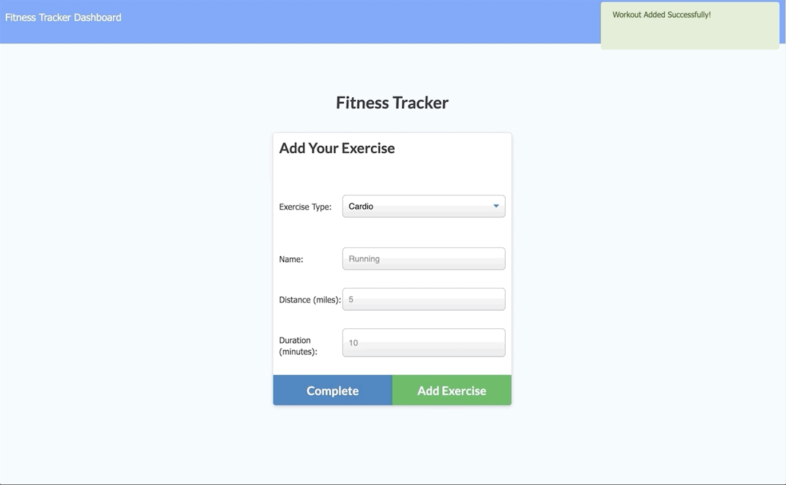
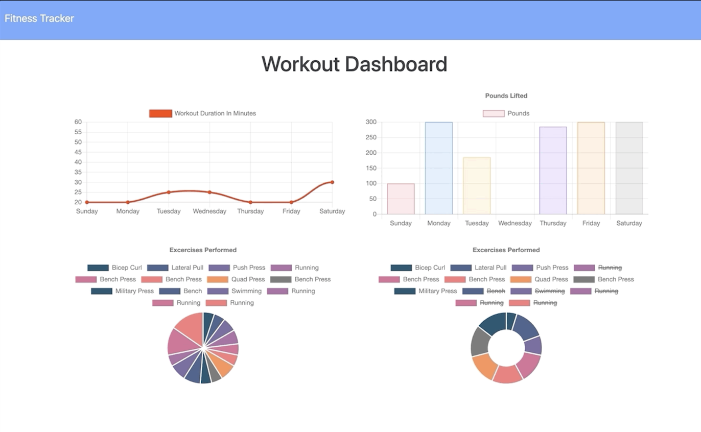

### Workout Tracker

Workout tracker application. I worked along with front end code which required me to create a Mongo database with a Mongoose schema and handle routes with 

Express.

### User Story

As a user, I want to be able to view create and track daily workouts. I want to be able to log multiple exercises in a workout on a given day. 

I should also be able to track the name, type, weight, sets, reps, and duration of exercise. 

If the exercise is a cardio exercise, I should be able to track my distance traveled.

### Business Context

A consumer will reach their fitness goals more quickly when they track their workout progress.

### Acceptance Criteria

When the user loads the page, they should be given the option to create a new workout or continue with their last workout.

The user should be able to:

Add exercises to the most recent workout plan.

Add new exercises to a new workout plan.

View the combined weight of multiple exercises from the past seven workouts on the stats page.

View the total duration of each workout from the past seven workouts on the stats page.

To deploy an application with a MongoDB database to Heroku, you'll need to set up a MongoDB Atlas account and connect a database from there to your application. Be sure to use the 

following guides for support:

Set Up MongoDB Atlas

Deploy with Heroku and MongoDB Atlas

### Functionality
When the user loads the page, they should be given the option to create a new workout, or continue with their last workout.

The user should be able to:

Add exercises to a previous workout plan.

Add new exercises to a new workout plan.

View multiple the combined weight of multiple exercises on the stats page.

### Usage

The application best serves those interested in exercise by allowing users to create workout plans by adding different exercises. This helps users to track their fitness goals.

## Screenshots:

**Main.**

## View Project

Check the link below for finished project.

https://obscure-tor-50223.herokuapp.com/

GitHub Link:

https://github.com/Nikstar-1/Workout-Tracker

### License

MIT License

Copyright (c) 2020 Rekha Kumari

Permission is hereby granted, free of charge, to any person obtaining a copy of this software and associated documentation files (the "Software"), to deal in the Software without 

restriction, including without limitation the rights to use, copy, modify, merge, publish, distribute, sublicense, and/or sell copies of the Software, and to permit persons to whom the 

Software is furnished to do so, subject to the following conditions:

The above copyright notice and this permission notice shall be included in all copies or substantial portions of the Software.

THE SOFTWARE IS PROVIDED "AS IS", WITHOUT WARRANTY OF ANY KIND, EXPRESS OR IMPLIED, INCLUDING BUT NOT LIMITED TO THE WARRANTIES OF MERCHANTABILITY, FITNESS FOR A PARTICULAR PURPOSE AND 

NONINFRINGEMENT. IN NO EVENT SHALL THE AUTHORS OR COPYRIGHT HOLDERS BE LIABLE FOR ANY CLAIM, DAMAGES OR OTHER LIABILITY, WHETHER IN AN ACTION OF CONTRACT, TORT OR OTHERWISE, ARISING 

FROM, OUT OF OR IN CONNECTION WITH THE SOFTWARE OR THE USE OR OTHER DEALINGS IN THE SOFTWARE.

### Technologies
 
Node.js -‏‏‎ ‎ ‏‏‎ ‎An asynchronous event-driven runtime built on Chrome's V8 JavaScript engine.
 
 ‏‏‎‏
Express.js - ‎ ‏‏‎ ‎Minimalist web framework for Node.js.

 ‏‏‎‏
MongoDB - ‎ ‏‏‎ ‎The most popular database for modern apps.
 
 ‏
Mongoose npm - ‏‏‎ ‎A MongoDB object modeling tool designed to work in an asynchronous environment.

Heroku -‏‏‎ ‎ ‏‏‎ ‎A platform that enables developers to build, run, & operate applications entirely in the cloud.

Morgan npm -‏‏‎ ‎ ‏‏‎ ‎HTTP request logger middleware for node.js that is named after Dexter.

Postman - Checking end points.

## Author

Rekha Kumari

Rekha Kumari © 2020. All rights reserved.
